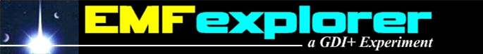
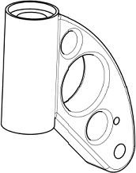
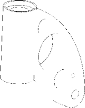
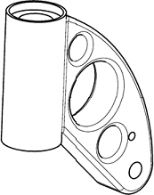
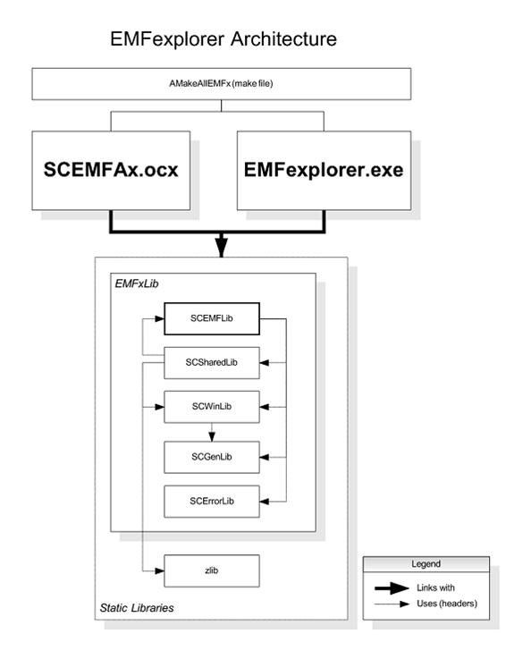

# EMFexplorer

  <!-- Replace this with your actual banner image link or drag-and-drop the file here -->
  

**EMFexplorer** is a legacy C++/MFC graphics utility designed to parse, inspect, and render Windows Enhanced Metafiles (`.emf`). Originally developed in 2004, this project served as a technical implementation for exploring GDI+ and low-level Windows graphics structures.

### The Smoothing Proof

When rendering complex technical drawings, the difference between the standard Windows GDI and EMFexplorer's custom GDI+ treatment is night and day.

| Original PDF | EMF | EMF |
| :---: | :---: | :---: |
|  |  |  |
| **Original PDF** (by Adobe Acrobat) | **EMF** (by Windows GDI) | **EMF** (by EMFexplorer) |

  <i>Figure: EMFexplorer smoothing and anti-aliasing comparison.</i>

> **Note:** The example was chosen (images are not falsified) to make the point as clear as possible; of course not all GDI outputs are that bad.

---

## ⚠️ Project Status: Archived
This repository is a clean, historical archive of the original 2004 codebase. 
* **Status:** Stable / Locked.
* **Maintenance:** No active development, updates, or bug fixes will be provided.
* **Purpose:** Preserved solely for educational, historical, and reverse-engineering reference.

## Project & Package Architecture
The underlying engine bridges high-level document handling with low-level vector manipulation. The graphics library specializes in parsing and reusing documents formatted as Enhanced Metafile Format (`.emf`), Windows Metafile (`.wmf`), and GDI+ supported bitmap formats (`.bmp`, `.jpeg`, `.png`, `.tiff`, `.gif`).

  <!-- Replace this with your actual architecture image link or drag-and-drop the file here -->
  

### Key Subsystems (2004 Implementation)
* **Graphics Engine:** Custom parsing abstraction layer built to isolate and reconstruct scalable vector graphic layers.
* **Demonstration Subsystem (`EMFexplorer.exe`):** The main interactive desktop client containing the visual layout analyzer and step-by-step record inspector tree.
* **ActiveX Controller (`SCEMFAx.ocx`):** A scriptable component designed for historical web integration, supporting progressive image streaming, parsing, and real-time canvas rendering.

---

## Historical Test Suites & Assets
The development and quality control of EMFexplorer relied on multi-platform metafile evaluation. The classic validation packages have been bundled into a single downloadable testing package containing distinct verification suites:

📦 **[Download the Testing Corpus (testfiles.zip)](testfiles.zip)** *(~35 MB)*

### Included Suites
* **MiniCorpus:** The curated mini Charles E. Caplife corpus featuring multi-layered, highly complex vector structures to push layout engines to their rendering limits.
* **emf_tests:** A collection of small, targeted test files ideal for isolating individual GDI/GDI+ record types, tree parsing parameters, and regression boundaries.
* **ActiveXTests:** Specialized test environments featuring compressed Enhanced Metafile format profiles (`.emz`), preserved directly from the historical web integration and progressive streaming development framework.

---

## Features (2004 Context)
* Low-level parsing of GDI/GDI+ Metafile structures.
* Visual tree representation of EMF records and parameters.
* Direct rendering preview using Win32 / MFC graphics pipelines.
* Export capabilities to standard formats available at the time.

## Repository Cleanup
The codebase has been cleaned for modern archival:
* Removed all legacy IDE temporary build artifacts (`.ncb`, `.opt`, `.plg`, `Debug/`, `Release/`).
* Standardized under the permissive **MIT License**.
* Retained raw source code (`.cpp`, `.h`, `.rc`) and assets.

## Documentation & Continuity
For context regarding the architecture or to follow current engineering notes, visit the main laboratory:
👉 **[drcharleslabs.com](https://drcharleslabs.com)**

---
*Copyright © 2004-2026 Smith Charles. Released under the MIT License.*
